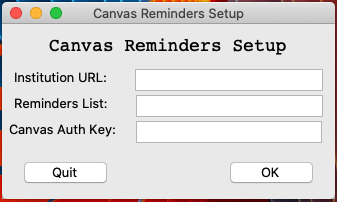

# Canvas Reminders
Canvas reminders is a script that automates adding Canvas's Todo list to your Apple Reminders.

## Download
You can download Canvas Reminders [Here](../../releases/)

## Using Canvas Reminders
In order for Canvas Reminders to work, you need to fill out the api_keys.txt with your instiutions canvas url and an access key for your canvas account
(which can be generated from your canvas account settings).
This is done through the setup screen which will create and save the information so that you can continue to update your reminders without having to re-enter your information.

For Example:

To Generate the keycode I recommend this [Guide](https://community.canvaslms.com/t5/Admin-Guide/How-do-I-obtain-an-API-access-token-in-the-Canvas-Data-Portal/ta-p/157)

### How it works
Canvas Reminders utilizes the canvasapi module to collect data from canvas. I target the Todo list, this is then parsed into a readable format for each
assignment. From there I call an embeded applescript to collect all the current reminders within the specified list, if there are any. Once I have these two lists I start
adding the todo's assignments to the Reminder list. This is done by checking if the new reminder item is already in the list, if it is ignore it. If it is not, then create a new reminder with the name and due date.
